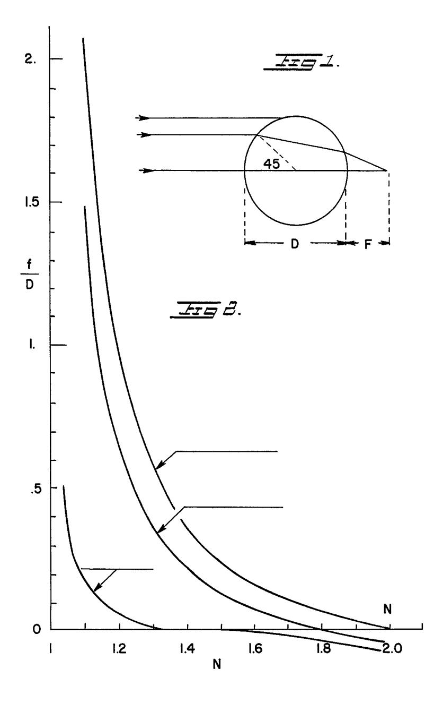
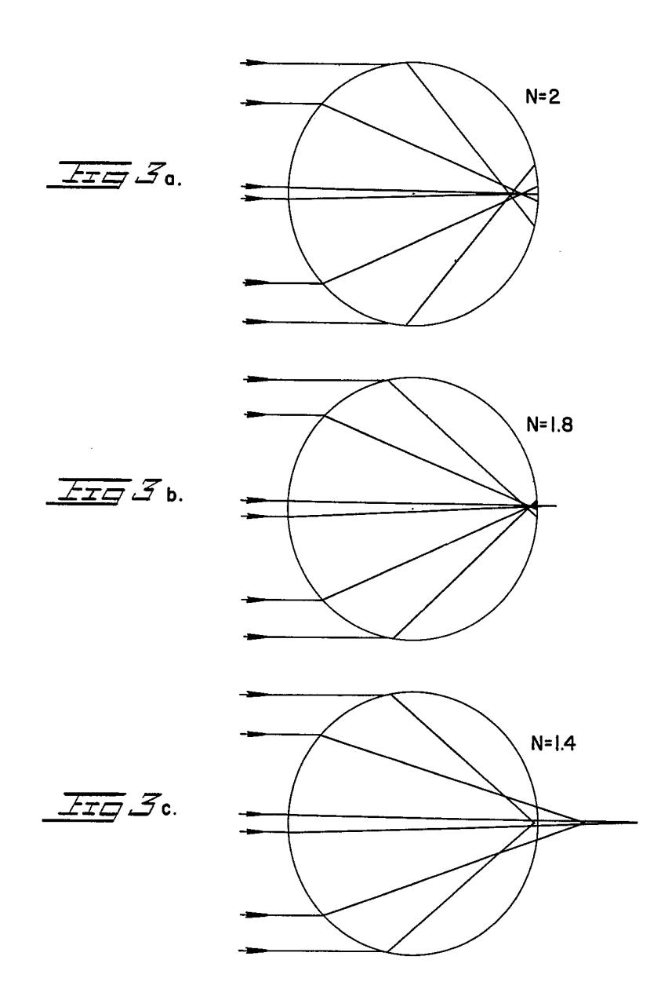

# **BREVET D'INVENTION**

# MINISTÈRE DE L'INDUSTRIE

SERVICE

de la PROPRIÉTÉ INDUSTRIELLE

P.V. nº 969.876

**Classification internationale :** 

№ 1.388.413 C 03 c

Composition pour la fabrication de verre.

Société dite : CATAPHOTE CORPORATION résidant aux États-Unis d'Amérique.

Demandé le 6 avril 1964, à 15h 6m, à Paris. Délivré par arrêté du 28 décembre 1964. (Bulletin officiel de la Propriété industrielle, n° 6 de 1965.)

(Demande de brevet déposée aux États-Unis d'Amérique le 22 avril 1963, sous le n° 274.523, aux noms de MM. Charles E. SEARIGHT, EZRA M. ALEXANDER, John R. RYAN et Dominick LABINO.)

La présente invention se rapporte à de nouvelles compositions de verre qui conviennent plus particulièrement pour la fabrication de perles de verre, mais également pour la production de divers autres matériaux, tels que des paillettes.

Les perles de verre conformes à l'invention sont particulièrement utilisables comme éléments réfléchissants incorporés dans des peintures pour autoroutes et accotements, pour des panneaux réfléchissants et, d'une manière générale, pour toutes les surfaces devant s'éclairer par réflexion de rayons lumineux. Pour obtenir une luminosité de réflexion sous l'action de rayons lumineux incidents, il est avantageux d'utiliser des éléments rétro-réfléchissants.

De tels éléments rétro-réfléchissants ont la propriété de concentrer la lumière issue de sources éloignées en un point voisin de la surface arrière de la sphère qui les constitue; un réflecteur, tel qu'une peinture, une feuille d'étain, etc., doit être prévu pour renvoyer la lumière ainsi concentrée, à travers les perles, suivant une direction essentiellement parallèle à celle de la lumière incidente.

Un système rétro-réfléchissant de ce genre opère efficacement lorsque la lumière est focalisée à, ou près de, la surface arrière des perles sphériques et lorsque le milieu situé derrière ces perles a un haut pouvoir réfléchissant. On sait que la première condition exige que les perles soient faites d'un verre ayant un indice de réfraction élevé.

D'autres caractéristiques et avantages de l'invention ressortiront de la description qui va suivre, en référence au dessin annexé, dans lequel :

La figure 1 est une représentation schématique montrant la trajectoire des rayons lumineux dans une lentille sphérique;

La figure 2 est un diagramme de la distance

focale relative f/D d'une lentille sphérique en fonction de son indice de réfraction effective N; et,

Les figures 3a, 3b et 3c sont des diagrammes montrant les trajectoires calculées de rayons axiaux à  $45^{\circ}$  et périphériques à travers des sphères ayant des indices de réfraction effectifs N égaux à 2, 1,8 et 1,4 respectivement.

La formule suivante indique la distance focale des rayons axiaux (fig. 1) ayant traversé une lentille sphérique :

$$f = r \frac{(2 - N)}{2N - 2}$$

Dans cette formule f désigne la distance entre le foyer et la surface arrière de la sphère; r le rayon de la sphère et  $N = n/n_o$ , l'indice de réfraction effectif. L'indice de réfraction effectif N est le rapport de l'indice de la matière dont les perles sont faites à celui du milieu environnant.

Pour des rayons plus éloignés de l'axe, la distance focale est plus courte que celle donnée par la formule 1. En conséquence, il n'existe pas de chiffre unique exprimant la distance focale d'une sphère. Toutefois, pour des raisons pratiques, il peut être utile de connaître la valeur de l'indice de réfraction effective N pour laquelle la majeure partie du flux lumineux est concentrée près de la surface arrière de la sphère. A cette fin, on a calculé les distances focales pour trois rayons paraaxiaux pour une série d'indices de réfraction compris entre 1 et 2. Les résultats ont été pointés sur la figure 1. La « distance focale réactive » est la distance focale mesurée à partir de la surface arrière de la sphère, exprimée en fonction du diamètre D de la sphère. On voit qu'il faut un indice de réfraction effectif égal à 2 pour focaliser les rayons axiaux à la surface arrière (f/D = 0), tan-

65 2191 0 73 114 3 **•** Prix du fascicule : 2 francs

### [1.388.413]

dis qu'il suffit d'avoir un indice effectif N = 1.8pour obtenir le même résultat avec les rayons à 45°, et seulement N = 1,4 pour les rayons périphériques. Ces trois cas sont clairement illustrés par la figure 2. Avec N = 2, tous les rayons, sauf un étroit pinceau de rayons axiaux, sont focalisés à l'intérieur de la sphère et le flux lumineux concentré résultant s'étale sur une petite aire circulaire de la surface arrière. Avec N = 1.4 la situation est inverse, en effet, tous les rayons sont focalisés derrière la sphère, sauf les rayons périphériques. Le résultat net est, toutefois, en gros, le même que dans le premier cas, la zone fortement éclairée ayant approximativement les mêmes dimensions à la surface arrière de la sphère. Le cas intermédiaire où N = 1,8 semble donner un meilleur résultat que les deux cas extrêmes. En réalité, un examen plus approfondi montre qu'il est plus important d'avoir une bonne approximation de la distance focale pour le flux lumineux compris entre les rayons axiaux et les rayons à 45° que pour le flux périphérique, en raison des grandes pertes de réflexion lorsque les angles d'incidence sont grands. En conséquence, un indice effectif compris entre 1,8 et 2 représente la valeur optimale.

Lorsque les perles de verre sont utilisées de telle manière que seule leur surface arrière est au contact de la couche réfléchissante, leur surface frontale est exposée à l'air  $(n_0 = 1)$ . La réfraction à la surface frontale de la perle n'est déterminée que par l'indice de réfraction axiale n du verre. Tant que tous les rayons sont focalisés à l'intérieur ou à la surface arrière, il n'y a pas lieu de tenir compte de l'indice de réfraction du milieu situé en arrière des perles. C'est cette considération qui a conduit à spécifier que l'indice de réfraction de la composition de verre désirée doit être n = 1.9.

Il existe de nombreuses compositions de verre du commerce dont les indices de réfraction ont été calculés pour obtenir une brillance optimale, etc., et qui conviennent à la fabrication de perles de verre. Jusqu'à présent, ces diverses compositions contenaient de l'oxyde de plomb, ce qui était très avantageux pour de nombreuses raisons, mais avait pour effet de conférer généralement à ces verres une légère coloration jaune; de plus, ces perles de verre ternissaient lorsqu'elles étaient exposées à des atmosphères contenant des fumées sulfureuses, à cause de la formation de sulfure de plomb. De plus, la fusion de l'oxyde de plomb est nuisible à la santé du personnel, les fumées étant dangereuses.

Plus récemment, on a utilisé des verres essentiellement incolores à haut indice de réfraction, exempts de plomb, remédiant ainsi à un grand nombre des difficultés que l'on rencontre avec les verres contenant de l'oxyde de plomb. Toutefois, ces verres plus récents, sans plomb, étaient caractérisés par une grande densité, une grande chaleur spécifique, un prix élevé et des tensions superficielles relativement basses, comparativement aux compositions de verre de la présente invention. De plus, les verres de la technique antérieure ont tendance à devenir opalescents ou opaques, phénomène connu sous le nom de « dévitrification ».

2

Les perles faites de compositions de verre conformes à la présente invention remédient à la plupart des défauts de la technique antérieure. Ces défauts sont évités par des compositions de verre qui sont caractérisées par une tension superficielle sensiblement plus élevée et qui sont en même temps moins denses. Ces buts ainsi que d'autres, ont été atteints par le résultat inattendu découlant de l'addition de chaux à ces verres à haute teneur de baryum et de titane. Jusqu'à présent, on pensait que la chaux ou l'oxyde de calcium dévitrifieraient le verre et qu'il n'était pas possible d'en incorporer une quantité substantielle dans les verres à haute teneur de barvum et de titane sans nuire à leur transparence. L'oxyde de calcium diminue réellement la température de fusion des compositions de verre et ceci est également très surprenant et imprévisible puisque l'oxyde de calcium a un point de fusion voisin de 2 600 °C, et néanmoins, abaisse le point de fusion relativement bas de l'oxyde de baryum et du bioxyde de titane de façon appréciable. D'autre part, la chaux est, de loin, la matière première la moins coûteuse et son utilisation dans ces compositions de verre diminue appréciablement le prix de revient de ceux-ci. En effet, si on prend pour unité le prix de revient de la chaux, celui de l'oxyde de baryum est sept fois plus élevé et celui de l'oxyde de zinc quatorze et seize fois. Si la chaux n'avait pas eu la propriété inconnue d'abaisser le point de fusion des compositions de verre et de ne pas les dévitrifier, même en grande quantité, il n'aurait pas été possible de surmonter les inconvénients des compositions de la technique antérieure. De plus, l'oxyde de calcium a un haut indice de réfraction et contribue à élever l'indice de réfraction du verre.

Les compositions de verre de l'invention peuvent, fondamentalement, être décrites comme des systèmes vitreux à base de bioxyde de titane et de silicium, d'oxyde de baryum et de calcium. Le bioxyde de silicium est probablement le plus fort, le mieux connu et le plus répandu de tous les oxydes vitrogènes. Au moins 2/10 % de bioxyde de silicium sont présents dans les compositions de verre de l'invention, celui-ci aidant considérablement le bioxyde de titane dans la formation du verre.

Le bioxyde de titane n'est pas aussi connu, ni aussi répandu comme oxyde vitrogène; il s'est avéré plus difficile de former des verres avec du bioxyde de titane en l'absence de bioxyde de silicium. d'oxyde borique, d'oxyde de germanium ou d'antimoine. En conséquence, il est également avantageux que les compositions de verre contiennent au moins 0,2 % en poids d'oxyde borique et d'oxyde de sodium. De même, du fait que l'oxyde de calcium diminue considérablement les points de fusion et d'affinage de ces compositions de verre, il est préférable qu'il soit présent dans une proportion d'au moins 6 à 7 % en poids.

Les compositions de verre de l'invention comprennent essentiellement, en poids, environ 10%à 50 % de bioxyde de titane, environ 10% à 65 % d'oxyde du type RO choisi dans le groupe comprenant l'oxyde de baryum et l'oxyde de zinc, au moins 10% d'oxyde de barium, environ 6% à 40 % d'oxyde de calcium et environ 0,2 % à 0,30 % de bioxyde de silicium. Ces compositions peuvent également contenir, en poids, jusqu'à 14 % d'acide borique, jusqu'à 16 % d'oxyde de métaux alcalins, jusqu'à 16 % d'oxyde de zinc et jusqu'à 6 % d'alumine.

Les proportions indiquées ci-dessus se rapportent à des compositions de verre de l'invention dont les indices de réfraction sont compris entre 1,6 et 2 environ.

Le tableau I ci-après illustre divers exemples de compositions de verre entrant dans le cadre de l'invention, les parties étant données en poids :

|          | TiO2     | BaO             | CaO       | Na2O          | SiO 2 | B 2 O 3 | Al 2 O 3 | ZnO            | Indice de réfraction | Densité    |
|----------|----------|-----------------|-----------|---------------|------------------|-------------------------------|--------------------------------|----------------|----------------------------|------------|
| 1        | 20       | 20              | 7         | 8             | 25               | 9,5                           |                                | 10,5           | 1,68                       | 3,2        |
| 2        | 10       | 20 40        | 7         | о 8        | 25 15         | 9,5 9,5                    | -                              | 10,5           | 1,68                       | 3,2 3,7 |
| 3        | 20       | $\frac{40}{15}$ | 30        | 0 4        | -30              |                               | -                              |                | 1,08                       |            |
| 3 4   | 15       | 13 10        | 50 40  | 4 4        | 30               | 0,5 0.5                    | 0,5 0.5                     | -              |                            | 3,5        |
| 5        | 20       | 10 35        | 40 20  | 4.            | 30 20         | 0,5 0,5                    | 0,5 0.5                     |                | 1,76 1,81               | 3,4 4,0 |
| 6        | 10       | 50 50        | 20 7   | 5             | 20 20         | 0,5 8                      | 0,5                            | -              | 1,61                       |            |
| 7        | 20       | 30 20        | 7         | 12            | 20 30         |                               | -                              | - 15           | 1,69                       | 3,7 2 1 |
| 8        | 20       | 20 25        | 30        | 4             | 50 15         | 9,5 0.5                    | - 0 r                       | 1,5            | 1,84                       | 3,1        |
| 9        | 25       | 25 35        | 30 20  | 4 2        | 15 16         | 0,5 2                      | 0,5                            | -              | 1,04                       | 3,8 3,8 |
| 10       | 25       | 35 35        | 20 20  | 2 0,5      | 10               |                               | 2                              | -              |                            |            |
| 10       | 25       | 55 15        | 40 40  | 0,5 14     | 5                | 1,5                           |                                | -              | 1,83                       | 3,9 24  |
| 12       | 25 25 | 15 35        | 40 10  | 0,5           |                  | 0,5                           | 0,5                            |                | 1,81                       | 3,4        |
| 12       | 15       | 55 43        | 10        | 0,5 2      | 14 14         | 5,5                           | 2                              | $\frac{10}{3}$ | 1,79                       | 3,6        |
| 14       | 22,2     | 45 38,9      | -         |               |                  | 14                            |                                |                | 1,67                       | 3,2        |
| 14       | 36       | 30,9 40      | 11,1 7 | 4,4           | 22,2             | 0,6                           | 0,6                            | -              | 1,81                       | 4,0        |
| 16       | 20       | 40 30        | 19        | $\frac{1}{2}$ | 12               | $\frac{1}{2}$                 | -                              | 3              | 1,89                       | 3,9        |
| 17       | 35       | 30 46        | 6         | 2 1        | 20               |                               | 6                              | 1              | 1,77                       | 3,7        |
| 18       | 35 37 |                 | 0 7    |               | 11               | 1                             | -                              | -              | 1,92                       | 4,1        |
| 10       | 39       | 28,5 28      |           | 1,5           | 11               | -                             | -                              | 15             | 1,90                       | 4,2        |
| 19 20 | 39 48 | 28 35        | 6         | 1             | 9                | 1                             | -                              | 16             | 1,90                       | 4,1        |
| 20 21 | 48 35 | 35 46        | 7 7    | -             | 5                | 1                             | -                              | 4              | 1,95                       | 4,1        |
|          |          |                 |           | 1             | 10               | 1                             | -                              |                | 1,95                       | 4,1        |
| 22       | 45       | 37,8            | 7         | 0,2           | 5                | 1                             | -                              | 4              | 1,96                       | 4,0        |

TABLEAU I

Le tableau II permet de comparer deux exemples spécifiques de verre conformes à la technique antérieure et des exemples de verre selon l'invention en ce qui concerne les propriétés extrêmement importantes pour la fabrication de perles que sont la tension superficielle et la chaleur spécifique.

| <b>m</b>   | TT |
|------------|----|
| TABLEAU    |    |
| 1 11010000 | ** |

|                         | Tension superficielle (Dynes/cm à 900 °C) | Chaleur spécifique (Cal/gm/°C) |
|-------------------------|----------------------------------------------------|--------------------------------------|
| Exemple 1               | 291,0                                              | 0,161                                |
| Exemple 2               | 314,0                                              | 0,141                                |
| Exemple 16 du tableau I | 377,0                                              | 0,120                                |
| Exemple 18 du tableau I | 355,0                                              | 0,116                                |

La composition en moles % de l'exemple antérieur 1 est la suivante :

|                   | %    |
|-------------------|------|
| Diamala da diama  |      |
| Bioxyde de titane | 42,0 |
| Oxyde de baryum   | 35,1 |
| Oxyde borique     | 10,4 |
| Oxyde de zinc     | 12,4 |

La composition en moles % de l'exemple antérieur 2 est la suivante :

|                                            | %             |
|--------------------------------------------|---------------|
| Bioxyde de titane                          | 43 <b>,</b> 7 |
| Oxyde de baryum                            | 38,6          |
| Oxyde borique                              | 17,7          |
| Impuretés et autres composants secondaires | 4,3           |

#### [1.388.413]

Les compositions de verre de l'invention peuvent être préparées par une fournée de composants dans un four à verre classique formé de matière réfractaire classique exempte de substances contaminantes, en particulier de fer. Cette fournée se compose d'oxydes ou de composés décomposables en oxydes dans les conditions où s'effectue la fusion dans les proportions voulues pour produire les compositions spécifiées. En général, le titane, l'aluminium et le zinc sont introduits sous forme d'oxydes; le baryum est introduit entièrement ou en partie sous forme de peroxyde, le reste sous forme d'oxydes ou de carbonates; le calcium et le sodium peuvent être ajoutés sous forme de carbonates; la silice peut être introduite sous forme de sable de quartz de haute qualité; tandis que le bore peut être utilisé sous forme d'acide borique.

Le point de fusion des compositions de verre de l'invention se situe entre 1 100 et 1 400 °C. Le mélange est, de préférence, introduit dans le four en continu, ou par doses successives, en permettant à chaque dose de fondre avant d'ajouter la suivante, jusqu'à ce que la fonte de verre ait été amenée au niveau désiré, ce qui peut demander de quatre à dix heures.

Quand la fonte a été préparée, elle peut être transformée en perles de verre par les procédés classiques, soit directement à partir de la fonte, soit en versant un courant de verre en fusion dans de l'eau afin de former du grésil, dont les particules sont soufflées ou versées à travers une flamme très chaude ou une zone de chaleur rayonnante, afin de les amollir suffisamment pour former des sphères sous l'action de leur tension superficielle, cet amollissement étant suivi d'un refroidissement rapide afin de durcir les sphères sans dévitrification.

#### RÉSUMÉ

1º Composition de verre à haut indice de réfraction qui se compose essentiellement, en poids, d'environ 10 à 50 % de bioxyde de titane, d'environ 10 à 65 % d'oxyde du type RO choisi dans le groupe comprenant l'oxyde de baryum et l'oxyde de zinc, dont 10 % au moins d'oxyde de baryum, d'environ 6 % à 40 % d'oxyde de calcium et d'environ 0.2 % à 30 % de bioxyde de silicium:

2º Composition selon 1º, qui contient jusqu'à 14 % en poids d'oxyde borique;

3º Composition selon 1º, qui contient jusqu'à 16 % en poids d'oxyde de sodium;

4º Composition selon 1º, qui contient jusqu'à 16 % en poids d'oxyde de zinc;

5º Composition selon 1º, qui contient jusqu'à 6 % d'alumine;

6º Composition de verre qui est essentiellement constituée par, les pourcentages étant exprimés en poids :

| 4 |  |
|---|--|
|---|--|

|                   | %    |
|-------------------|------|
| TiO 2  | 20   |
| BaO               | 20   |
| CaO               | 7    |
| Na 2 O | 8    |
| $SiO_2$           | 25   |
| $B_2O_3$          | 9,5  |
| ZnO               | 10,5 |
|                   |      |

7º Composition essentiellement constituée par, les pourcentages étant indiqués en poids :

|                                | %   |
|--------------------------------|-----|
| TiO 2               | 15  |
| BaO                            | 10  |
| CaO                            | 40  |
| Na 2 O              | 4   |
| SiO 2               | 30  |
| B 2 O 3  | 0,5 |
| Al 2 O 3 | 0,5 |

8º Composition essentiellement constituée par, les pourcentages étant indiqués en poids :

|                   | %  |
|-------------------|-------|
| TiO 2  | 25    |
| BaO               | 25    |
| CaO               | 30    |
| Na 2 O | 4     |
| $SiO_2$           | 15    |
| $B_2O_3$          | 0,5   |

9º Composition essentiellement constituée par, les pourcentages étant indiqués en poids :

| TiO 2              | 35 |
|-------------------------------|----|
| BaO                           | 46 |
| CaO                           | 7  |
| Na 2 O             | 1  |
| SiO 2              | 10 |
| B 2 O 3 | 1  |

10° Composition essentiellement constituée par, les pourcentages étant indiqués en poids :

|                               | 70   |
|-------------------------------|------|
| TiO 2              | 45   |
| BaO                           | 37,8 |
| CaO                           | 7    |
| Na 2 O             | 0,2  |
| SiO 2              | 5    |
| B 2 O 3 | 1    |
| ZnO                           | 4    |
|                               |      |

# Société dite : CATAPHOTE CORPORATION

## Par procuration :

#### Cabinet

D. MALÉMONT, J. COUVRAT-DESVERGNES & R. CHAUCHARD

