| (51) Int.Cl. |       | F I                    |         |         |        |       |      | テーマコー    | ド(参考)  |
|--------------|-------|------------------------|---------|---------|--------|-------|------|----------|--------|
| созс         | 3/21  | (2006.01)              | C O 3 C | 3/21    |        |       |      | 2K009    |        |
| GO2B         | 1/00  | (2006.01)              | GO2B    | 1/00    |        |       |      | 4G059    |        |
| G02B         | 1/10  | (2006.01)              | GO2B    | 1/10    |        | Ζ     |      | 4G062    |        |
| HO1L         | 31/02 | (2006.01)              | HO1L    | 31/02   |        | В     |      | 5F088    |        |
| F21V         | 3/00  |                        | F 2 1 V | 3/00    | 300    | )     |      |          |        |
|              |       | • •                    | 査請求 未   | 請求      | 青求項の   | 数 6   | ΟL   | (全 17 頁) | 最終頁に続く |
| (21) 出願番号    |       | 特願2012-78801 (P2012-78 | 3801)   | (71) 出原 | 頭人 000 | 0051  | 08   |          |        |
| (22) 出願日     |       | 平成24年3月30日 (2012.3.    | 30)     |         | 株:     | 式会社   | ±日立≇ | 製作所      |        |
|              |       |                        |         |         | 東      | 京都-   | F代田D | 区丸の内一丁目  | 6番6号   |
|              |       |                        |         | (74) 代理 | 里人 100 | )1003 | 10   |          |        |
|              |       |                        |         |         | 弁      | 運士    | 井上   | 学        |        |
|              |       |                        |         | (74) 代理 | 里人 100 | 0986  | 60   |          |        |
|              |       |                        |         |         | 弁      | 運士    | 戸田   | 裕二       |        |
|              |       |                        |         | (74) 代理 | 里人 100 | 0917  | 20   |          |        |
|              |       |                        |         |         | 弁      | 運士    | 岩崎   | 重美       |        |
|              |       |                        |         | (72) 発明 | 月者 島口  | 倚     | 譲    |          |        |
|              |       |                        |         |         | 茨      | 成県E   | ヨ立市フ | 大みか町七丁目  | 1番1号   |
|              |       |                        |         |         |        |       |      | 株式会      | 社日立製作所 |
|              |       |                        |         |         | 日:     | 立研乳   | 鄂内   |          |        |
|              |       |                        |         |         |        |       |      |          |        |
|              |       |                        |         |         |        |       |      | 最        | 終頁に続く  |

(57)【要約】

Ωcm以下であることを特徴とする。上記ガラスがV2 5

を含有するガラスであり、V2 5の含有率が10重量パ

され、前記バナジウムを有するガラスの抵抗率が109

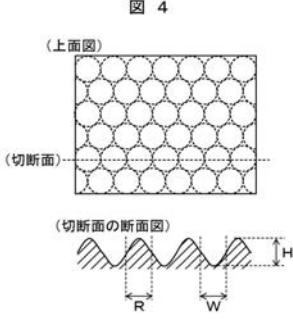

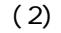

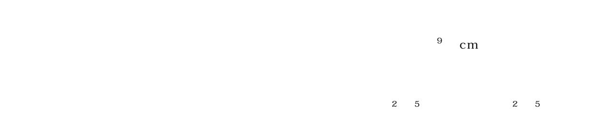

要とされる技術である。防汚技術の代表的な例として、(i)TiO2を含む塗料を表面 に塗布し、付着した有機物をUV光で分解して、表面の汚れを除去する技術、(ii)表面

技術(例えば特許文献1など)、(iii)親水性を示すSiO2ナノ粒子を含む塗料を表面

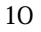

μm以下の凸部または凹部を有することを特徴とするガラス基材。

20

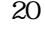

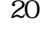

30

ジウムを有するガラスの抵抗率が、109Ωcm以下であることを特徴とする。

を有する。該バナジウムを有するガラスは、親水性を有し、抵抗率が109Ωcm以下であ れば特に制限はない。抵抗率が109Ωcmよりも大きくなると、ガラス基材表面に静電気 スは、V2 5を10重量パーセント以上、60重量パーセント以下含むことが望ましい。 2 5含有率が10重量パーセント未満では、十分な導電性が得られず、ガラス基材表面

に静電気が生じ易くなり、ホコリが吸着しやすくなる。また、V2 5含有率が60重量パ 化物の例として、P2 5、TeO2、Fe2 3、MnO2、ZnO、WO3、MoO3、Ba O、Ag2Oなどが挙げられる。

どの凹凸構造が挙げられる。また、微細構造の大きさは、最小寸法が好ましくは50μm 以下、より好ましくは10μm以下であることが望ましく、微細構造の形状や該ガラス基

スを有するガラスの作製方法は、V2 5を10重量パーセント以上、60重量パーセント

20

30

10

40

20

ガラス、のV2 5含有率は、10重量パーセント以上、50重量パーセント以下であるこ 基材が有する、バナジウムを有するガラス、のV2 5含有率は、通常の用途に比べて小さ

い方が望ましい。V2 5含有率が50重量パーセントより多い場合、ガラスの吸湿性が高 くなり、実用に耐えられなくなる。また、V2 5含有率が10重量パーセント未満では、

材を熱処理することにより、波長が600nm以上の光を透過させることが可能となる。ま

30 本発明のガラス基材は、赤外線(波長0.8~8μm)が透過するため、赤外線センサ

とが可能となる。赤外線センサーの検出器は0.8~8μmの波長を有する赤外線を検出 ウムを有するガラス、のV2 5含有率は、通常の用途に比べて小さい方が望ましく、10

重量パーセント以上、50重量パーセント以下であることが望ましい。V2 5含有率が5 また、V2 5含有率が10重量パーセント未満では、十分な導電性が得られず、ガラス基

50

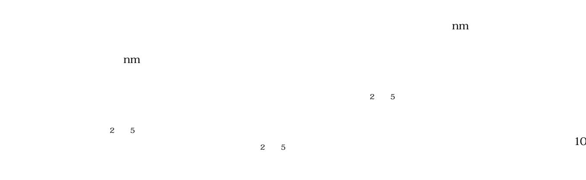

|     |  |                  |  |  | の成分は酸化物換算の重量比で表示した。ガラス原料として、バナジウムはV2                                  | 5、リン |
|-----|--|------------------|--|--|-----------------------------------------------------------------------|------|
| はP2 |  | 5、テルルはTeO2、鉄はFe2 |  |  | 3、カリウムはK2O、亜鉛はZnO、タングス テンはWO3、モリブデンはMoO3、バリウムはBa(PO3)2を用いた。バナジウムを有 |      |
|     |  |                  |  |  | するガラスは、次に述べる方法で作製した。原料となる各酸化物を配合・混合した原料1                              |      |

|    | 24                            |                               | ALTER REAL PROVIDENCE |                                | Webbolden (All Constants Fo |                  |                 |     |      |
|----|-------------------------------|-------------------------------|-----------------------|--------------------------------|-----------------------------|------------------|-----------------|-----|------|
|    |                               |                               | ガ                     | ラスの組                           | 成(重量9                       | 6)               |                 |     | 屈伏点  |
|    | V 2 O 5 | P 2 O 5 | TeO 2      | Fe 2 O 3 | $MnO_2$                     | K 2 0 | WO 3 | BaO | (°C) |
| V1 | 60                            | 20                            | 10                    | 5                              | 5                           |                  |                 |     | 307  |
| V2 | 50                            | 20                            | 20                    |                                |                             | 5                | 5               |     | 316  |
| V3 | 38                            | 5. 8                          | 30                    |                                |                             | 5                | 10              |     | 320  |
| V4 | 10                            | 30                            |                       |                                |                             |                  | 40              | 20  | 630  |

| 金型名 | $R(\mu m)$                                                                                                      | W(µm) | H(μm) |
|-----|-----------------------------------------------------------------------------------------------------------------|-------|-------|
| H1  | 2                                                                                                               | 2     | 1     |
| H2  | 0. 5                                                                                                            | 0. 5  | 0. 5  |
|     | 100 million 100 million 100 million 100 million 100 million 100 million 100 million 100 million 100 million 100 |       |       |

| 金型名 | $R(\mu m)$ | W(µm) | $H(\mu m)$ |
|-----|------------|-------|------------|
| H1  | 2          | 2     | 1          |
| H2  | 0. 5       | 0. 5  | 0. 5       |
|     | 2000 C     |       | 515 50     |

| 金型名 | $R(\mu m)$ | H(μm) |
|-----|------------|-------|
| H1  | 2          | 1     |
| H2  | 0. 5       | 0. 25 |

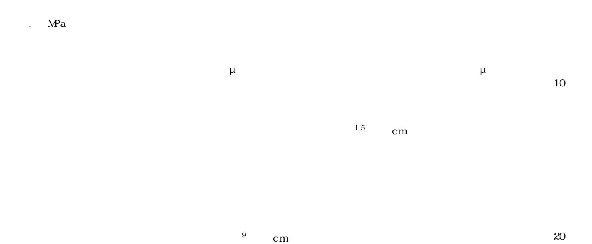

|           | V1   | V2               | V3               | V4                |
|-----------|------|------------------|------------------|-------------------|
| 抵抗率(Ω·cm) | <107 | <10 7 | <10 7 | 5×10 8 |

|  | 次に、本実施例で作製したガラス基材に対して、耐ホコリ吸着性、及び防汚特性の評価    |  |  |  |
|--|--------------------------------------------|--|--|--|
|  | を行った。結果を表4に示す。耐ホコリ特性は、1cm×1cm角のガラス基材を、微細構造 |  |  |  |
|  | を有する面を上面にして室内に2晩放置し、微細構造の表面に付着した、大きさが0.5m  |  |  |  |
|  | m以上のホコリの数を数えることにより評価した。また、防汚性は以下の手順で評価した   |  |  |  |
|  | 。まず、1cm×1cm角のガラス基材を、カーボンブラック(Vulcan XC-72) |  |  |  |

|      | <b>ドーッ サ</b> ++                 | 初期北      | 犬態       | 温度サイク    | ル試験後     |
|------|---------------------------------|----------|----------|----------|----------|
|      | ガラス基材                           | 耐ホコリ吸着性  | 防汚特性     | 耐ホコリ吸着性  | 防汚特性     |
|      | <ul><li>(ガラスー 金型)</li></ul> | (吸着したホコリ |          | (吸着したホコリ |          |
|      |                                 | の数(個))   | (a. u.)) | の数(個))   | (a. u.)) |
|      | V1-H1                           | 2        | 0. 8     | 2        | 0. 9     |
|      | V1-H2                           | 1        | 0. 6     | 2        | 0. 6     |
|      | V2-H1                           | 3        | 0. 9     | 4        | 1.0      |
|      | V2-H2                           | 2        | 0. 7     | 2        | 0. 7     |
|      | V3-H1                           | 4        | 1.0      | 4        | 1.1      |
|      | V3-H2                           | 2        | 0.8      | 3        | 0. 9     |
|      | V4-H1                           | 7        | 1. 2     | 7        | 1.4      |
|      | V4-H2                           | 5        | 1.0      | 6        | 1.0      |
|      | V1-M1                           | 3        | 1. 2     | 3        | 1.3      |
|      | V1-M2                           | 1        | 0. 9     | 2        | 0. 9     |
|      | V2-M1                           | 4        | 1. 2     | 4        | 1. 2     |
|      | V2-M2                           | 4        | 0.8      | 5        | 0. 9     |
|      | V3-M1                           | 5        | 1.4      | 5        | 1.4      |
| 中步向  | V3-M2                           | 3        | 1. 1     | 3        | 1. 2     |
| 実施例  | V4-M1                           | 8        | 1.8      | 9        | 1.8      |
|      | V4-M2                           | 4        | 1.4      | 4        | 1.4      |
|      | V1-L1                           | 3        | 1. 1     | 2        | 1. 2     |
|      | V1-L2                           | 1        | 0. 9     | 1        | 0. 9     |
|      | V2-L1                           | 4        | 1. 3     | 4        | 1.3      |
|      | V2-L2                           | 4        | 1. 0     | 5        | 1.0      |
|      | V3-L1                           | 5        | 1.3      | 5        | 1.4      |
|      | V3-L2                           | 3        | 1. 2     | 4        | 1.2      |
|      | V4-L1                           | 8        | 1. 7     | 9        | 1. 9     |
|      | V4-L2                           | 4        | 1.5      | 4        | 1.6      |
|      | V1-S                            | 1        | 2. 0     | 2        | 2. 3     |
|      | V2-S                            | 4        | 2. 2     | 4        | 2. 4     |
|      | V3-S                            | 5        | 2. 3     | 6        | 2. 4     |
|      | V4-S                            | 8        | 2. 3     | 8        | 2. 5     |
|      | V1-P                            | 2        | 10. 3    | 3        | —        |
| 比苏周日 | V2-P                            | 3        | 10. 8    | 3        | —        |
| 比較例1 | V3-P                            | 4        | 10.8     | 4        | —        |
|      | V4-P                            | 7        | 11.1     | 8        | —        |
| 比較例2 | C-1                             | >20      | 1.4      | >20      | 3. 4     |

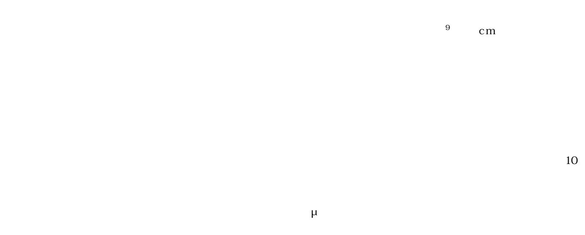

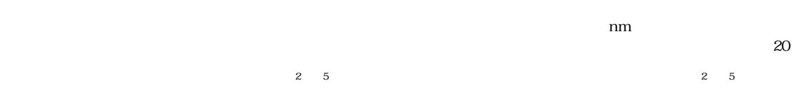

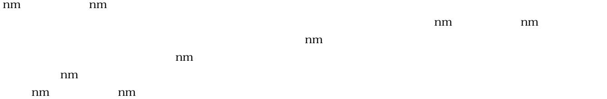

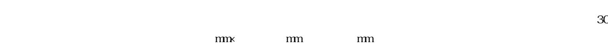

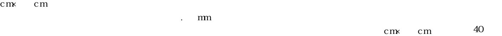

|      | 初期                            | 状態                         | 温度サイク                         | 7ル試験後                      |
|------|-------------------------------|----------------------------|-------------------------------|----------------------------|
|      | 耐ホコリ吸着性 (吸着したホコリ の数(個)) | 防汚特性 (表面炭素量 (a. u.)) | 耐ホコリ吸着性 (吸着したホコリ の数(個)) | 防汚特性 (表面炭素量 (a. u.)) |
| 実施例2 | 2                             | 1.0                        | 2                             | 1. 0                       |
| 実施例3 | 1                             | 0. 9                       | 2                             | 0. 9                       |
| 比較例3 | >20                           | 1. 3                       | 2                             | 3. 3                       |

覆われているため絶縁性であることに対し、実施例の防汚ガラスが109Ω・cm以下の低

20

30

表1に記載したガラス組成を有するV2を粒径3μm未満にまで粉砕し、その後、粉砕

)製)を用いて0.8MPaの圧力でサンドブラストを10秒間行い、センサー窓の表面に微

 表1に記載したガラス組成を有するV2を粒径3μm未満にまで粉砕し、その後、粉砕 その後、ペーストを膜厚が5μmになるように照明灯カバーに塗布し、330℃で熱処理

た、照度の測定波長域は、600nm~800nmとした。比較例5の照明灯の照度は3カ月

.8MPaの圧力でサンドブラストを10秒間行い、照明灯カバーの表面に微細構造を形成し

20

10

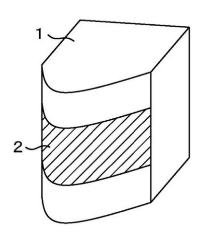

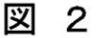

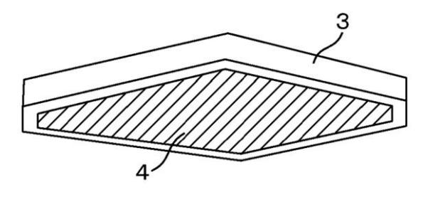

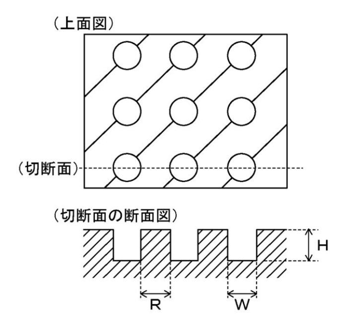

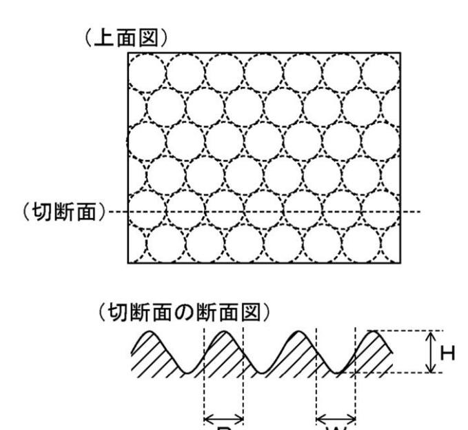

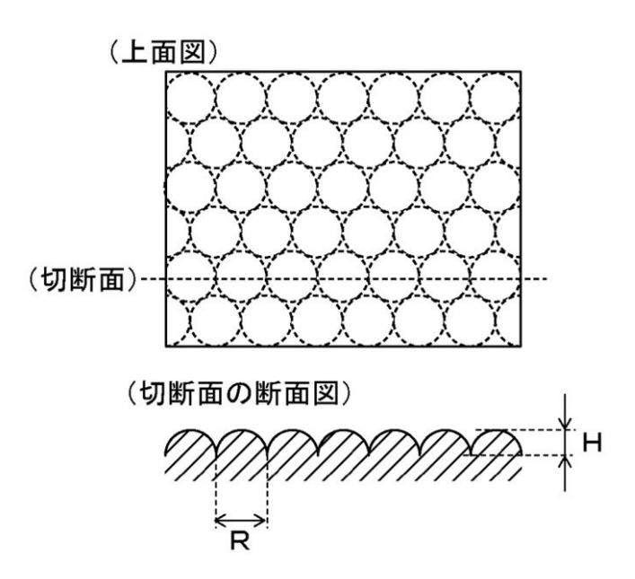

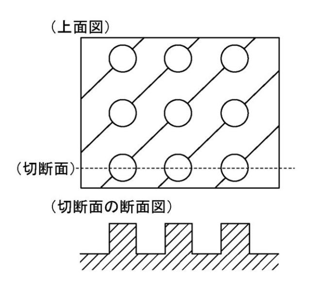

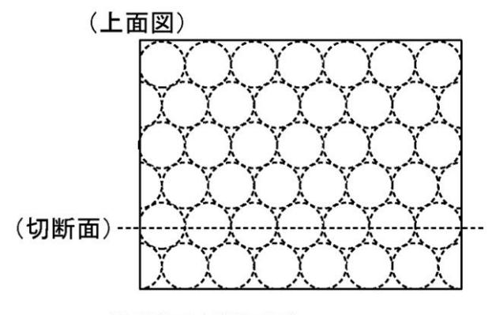

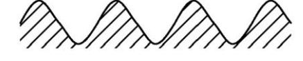

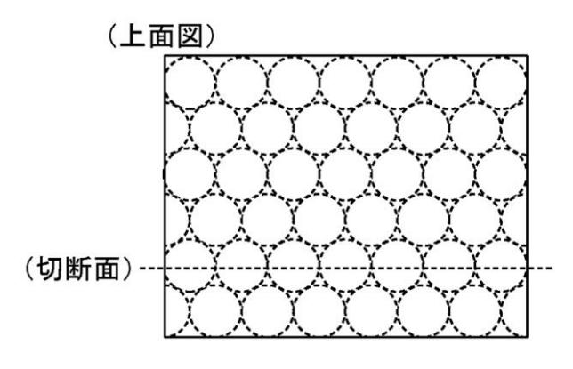

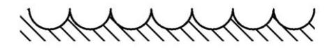

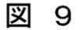

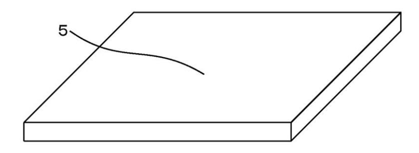

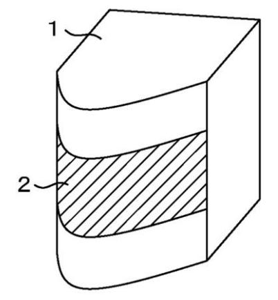

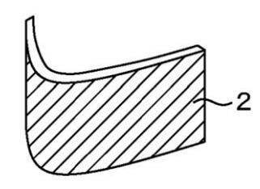

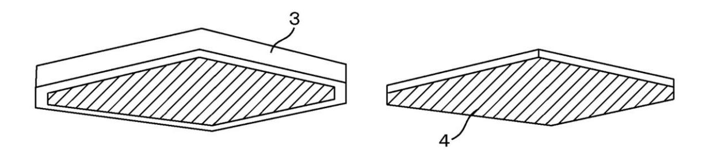

(51)Int.Cl. FI テーマコード(参考)

| 3/04 F21V  | (2006.01) | F21V 3/04 |
|---------------|-----------|--------------|
| 19/00 C03C | (2006.01) | F21V 3/04 |
| 11/00 C03B | (2006.01) | C03C 19/00   |
|               |           | C03B 11/00   |

(72)発明者 内藤 孝

(72)発明者 青柳 拓也

(72)発明者 沢井 裕一

- (72)発明者 藤枝 正
- (72)発明者 宮内 昭浩

(72)発明者 荻野 雅彦

Fターム(参考) 2K009 AA12 BB02 CC03 DD06 DD15 EE05 4G059 AA07 AA11 AC01 4G062 AA01 DA01 DB01 DC01 DD01 DD02 DD03 DD04 DE01 DE02 DF01 EA01 EA10 EB01 EC01 EC03 ED01 EE01 EF01 EG01 EG02 EG04 FA01 FB01 FC01 FD01 FE01 FF04 FF05 FF06 FG01 FH01 FJ01 FK01 FL01 GA01 GA10 GB01 GC01 GD01 GD02 GD04 GE01 HH01 HH03 HH04 HH05 HH07 HH08 HH09 HH10 HH11 HH12 HH13 HH15 HH17 HH20 JJ01 JJ03 JJ05 JJ07 JJ10 KK01 KK03 KK05 KK07 KK10 MM23 MM24 NN24 NN40 5F088 BA11 JA05 JA11 LA01