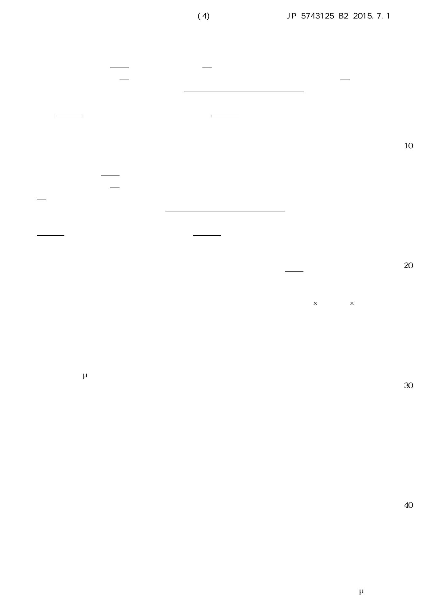
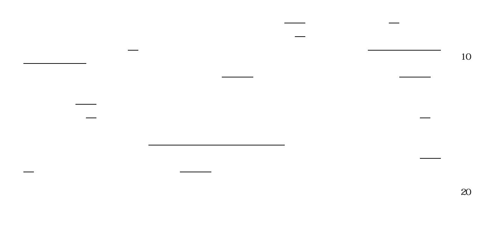

| (51) Int.Cl. |       |           | FΙ      |       |             |
|--------------|-------|-----------|---------|-------|-------------|
| созс         | 3/087 | (2006.01) | C O 3 C | 3/087 |             |
| созс         | 3/091 | (2006.01) | C O 3 C | 3/091 |             |
| созс         | 21/00 | (2006.01) | C O 3 C | 21/00 | $1 \ 0 \ 1$ |
| созв         | 17/06 | (2006.01) | C O 3 B | 17/06 |             |

| 請求項の数 1 | 4 (全 | 21 | 頁) |
|---------|------|----|----|
|---------|------|----|----|

| <ul> <li>(21)出願番号</li> <li>特願2007-252589 (P2007-252589)</li> <li>(22)出願日</li> <li>平成19年9月27日 (2007.9.27)</li> <li>(65)公開番号</li> <li>特開2009-84076 (P2009-84076A)</li> <li>(43)公開日</li> <li>平成21年4月23日 (2009.4.23)</li> <li>審査請求日</li> <li>平成22年8月2日 (2010.8.2)</li> </ul> | <ul> <li>(73)特許権者 000232243</li> <li>日本電気硝子株式会社</li> <li>滋賀県大津市晴嵐2丁目7番1号</li> <li>(72)発明者 村田 隆</li> <li>滋賀県大津市晴嵐2丁目7番1号 日本電</li> <li>気硝子株式会社内</li> </ul> |
|--------------------------------------------------------------------------------------------------------------------------------------------------------------------------------------------------------------------------------------------------------------------------|----------------------------------------------------------------------------------------------------------------------------------------------------------|
| 前置審査                                                                                                                                                                                                                                                                     | 審査官 吉川 潤 最終頁に続く                                                                                                                                       |

0.5%、SnO 0.01~6%を含有し、モル比で、(Li O+Na O+K

0%、K O 0.5~8%、CaO 0~6%、MgO 0~4%、Al +Mg

(57)【特許請求の範囲】

を通過し、50メッシュ(篩目開き300μm)に残るガラス粉末を白金ボートに入れ、

、B 0~8%、Li O 0~1%、Na O 8~20%、K O 0.5~

.01~6%を含有し、モル比で、(Li O+Na O+K O)/Al 比が1

7~15%、B 0~8%、Li O 0~1%、Na O 8~20%

10

20

30

40

SiO は、ガラスのネットワークを形成する成分であり、その含有量は40~75%

また本発明は、モル比で、(Li O+Na O+K O)/Al の比が、1.

また本発明は、MgO/Al の比が0~0.5であることを特徴とする。この比

アルカリ土類金属酸化物R'O(R'はMg、Ca、Sr、Baから選ばれる1種以上

R'Oの合量は、0~10%、好ましくは0~8%、より好ましくは0~7、さらに0~

 またR'Oの合量をR Oの合量で除した値が大きくなると、ガラスの耐失透性が悪化 する傾向が現れる。それ故、質量分率でR'O/R Oの値を0.5以下、0.3以下、 10

20

30

(1)モル%で、SiO 50~75%、Al 8~10.5%、B

01~5%、TiO 0~0.5%、SnO 0.01~6%を含有し、モル比で、

が1~2.5、MgO/Al 比が0~0.5であり、実質的にAs 、PbO

10 圧縮応力層の厚みは、10μm以上が好ましく、15μm以上、20μm以上、30μ m以上、40μ以上が最も好ましい。圧縮応力層の厚みが大きい程、ガラス基板に深い傷 方、ガラス基板が切断しにくくなるため、圧縮応力層の厚みは500μm以下とするのが

、標準篩30メッシュ(篩目開き500μm)を通過し、50メッシュ(篩目開き300

20

30

40

μm)に残るガラス粉末を白金ボートに入れ、温度勾配炉中に24時間保持した後、結晶

70~110×10-7/℃であることが好ましく、75~100×10-7/℃である ことがより好ましく、80~100×10-7/℃であることが更に好ましく、85~9 6×10-7/℃であることが特に好ましい。ガラスの熱膨張係数を上記範囲とすれば、 10

30

20

力が300MPa以上、且つ圧縮応力層の厚みが10μm以上になることが好ましく、ま た表面の圧縮応力が500MPa以上、且つ圧縮応力層の厚みが30μm以上になること が好ましく、さらに表面の圧縮応力が600MPa以上、且つ圧縮応力層の厚みが40μ

40

|                                 | No. 1 | No. 2 | No. 3 | No. 4 | No. 5 |
|---------------------------------|-------|-------|-------|-------|-------|
| SiO₂                            | 70.9  | 73.9  | 73.8  | 67.6  | 66.1  |
| Al 2 O 3  | 9.7   | 8.7   | 8.7   | 8.5   | 8.5   |
| ZnO                             |       |       |       | 1.5   | 3.0   |
| Na 2 O               | 9.7   | 13.0  | 8.7   | 8.5   | 8.5   |
| Lî₂O                            | 4.8   |       |       | 4.1   | 4.1   |
| K₂O                             | 4.8   | 4.3   | 8.7   | 3.7   | 3.7   |
| Sb 2 O 3  |       |       |       |       |       |
| ZrO2                            |       |       |       |       |       |
| TiO₂                            |       |       |       |       |       |
| B 2 O 3   |       |       |       |       |       |
| MgO                             |       |       |       | 6.0   | 6.0   |
| CaO                             |       |       |       |       |       |
| SnO 2                | 0.1   | 0.1   | 0.1   | 0.1   | 0.1   |
| 密度(g/cm³)                       | 2.42  | 2.41  | 2.41  | 2.46  | 2.50  |
| Ps (℃)                          | 455   | 491   | 497   | 493   | 495   |
| Та (°С)                         | 499   | 538   | 545   | 538   | 540   |
| Т \$ (℃)                        | 722   | 775   | 791   | 768   | 762   |
| 104 (℃)                         | 1136  | 1215  | 1249  | 1156  | 1138  |
| 10 3 (°C)            | 1370  | 1456  | 1494  | 1363  | 1338  |
| 1 0 2.5 (°C)         | 1517  | 1610  | 1650  | 1493  | 1466  |
| 熱膨張係数 (×10 -7 /℃) | 96    | 91    | 93    | 88    | 89    |
| 液相温度(℃)                         | 940   | 882   | 967   | 1008  | 1038  |
| logηTL                          | 5.3   | 6.3   | 5.8   | 5.0   | 4.7   |
| <b>圧縮応力</b> (MPa)               | 514   | 517   | 349   | 833   | 895   |
| 応力深さ(μm)                        | 3 1   | 4 2   | 57    | 17    | 15    |
| ヤング率 [GPa]                      | 74    | 69    | 67    | 77    | 77    |
| 剛性率 [GPa]                       | 3 1   | 29    | 28    | 3 2   | 3 2   |

|                                | No. 6 | No. 7 | No. 8 | No. 9 | No. 10 |
|--------------------------------|-------|-------|-------|-------|--------|
| SiO,                           | 66.9  | 65.4  | 66.9  | 66.4  | 62.3   |
| A   203                        | 8.5   | 8.5   | 8.4   | 8.6   | 8.4    |
| ZnO                            | 1.5   | 3.0   |       |       |        |
| Na 2 O              | 8.5   | 8.5   | 11.6  | 7.6   | 16.0   |
| LizO                           | 4.1   | 4.1   |       |       |        |
| K 2 O               | 3.7   | 3.7   | 4.2   | 7.5   | 3.5    |
| Sb 2 O 3 |       | ,     |       |       |        |
| ZrO2                           |       |       | 1.3   | 2.2   | 2.1    |
| TiO2                           | 0.7   | 0.7   |       |       |        |
| B 2 O 3  |       |       | 1.9   | 1.9   | 1.9    |
| MgO                            | 6.0   | 6.0   | 3.3   | 3.3   | 3.3    |
| CaO                            |       |       | 2.3   | 2.4   | 2.4    |
| SnO₂                           | 0.1   | 0.1   | 0.1   | 0.1   | 0.1    |
| 密度(g/cm³)                      | 2.47  | 2.51  | 2.49  | 2.50  | 2.54   |
| Ps (°C)                        | 496   | 498   | 544   | 574   | 529    |
| Ta (°C)                        | 540   | 541   | 589   | 623   | 570    |
| Ts (℃)                         | 761   | 755   | 812   | 867   | 773    |
| 104 (℃)                        | 1140  | 1127  | 1205  | 1253  | 1122   |
| 10³ (°C)                       | 1344  | 1325  | 1406  | 1447  | 1300   |
| 1 0 2.5 (°C)        | 1473  | 1451  | 1534  | 1570  | 1417   |
| 熱膨張係数                          | 89    | 89    | 90    | 89    | 100    |
| (×10 -7 ∕℃)         | 0.9   | 03    | 50    | 0.3   | 100    |
| 液相温度(℃)                        | 1009  | 1032  | 945   | 1075  | 855    |
| logηTL                         | 4.9   | 4.6   | 6.0   | 5.3   | 6.4    |
| 圧縮応力(MPa)                      | 845   | 902   | 819   | 638   | 837    |
| 応力深さ(µm)                       | 17    | 15    | 44    | 55    | 4 4    |
| ヤング率 [G P a]                   | 77    | 78    | 未     | 未     | 未      |
| 剛性率 [GPa]                      | 32    | 33    | 未     | 未     | 未      |

|                                | No. 11 | No. 12 |  |
|--------------------------------|--------|--------|--|
| SiO 2               | 77.1   | 73.9   |  |
| Al 2 O 3 | 5.7    | 8.7    |  |
| ZnO                            |        |        |  |
| Na 2 O              | 8.6    | 4.3    |  |
| Li₂O                           | 4.3    | 4.3    |  |
| K₂O                            | 4.3    | 8.7    |  |
| Sb 2 O 3 |        |        |  |
| ZrO2                           |        |        |  |
| ΤiΟ₂                           |        |        |  |
| B 2 O 3  |        |        |  |
| Mg0                            |        |        |  |
| CaO                            |        |        |  |
| SnO 2               |        | 0.1    |  |
| 密度(g/cm³)                      | 2.39   | 2.40   |  |
| Ps (°C)                        | 437    | 476    |  |
| Та (℃)                         | 482    | 523    |  |
| Т s (℃)                        | 704    | 767    |  |
| 104 (℃)                        | 1114   | 1212   |  |
| 1 0 3 (°C)          | 1348   | 1457   |  |
| 1 0 2.5 (°C)        | 1501   | 1611   |  |
| 熱膨張係数                          | 88     | 89     |  |
| (×10 -7 ∕℃)         | 00     | 03     |  |
| 液相温度(℃)                        | 815    | 1013   |  |
| ΙοgηΤL                         | 6.2    | 5.2    |  |
| 圧縮応力(MPa)                      | 325    | 324    |  |
| 応力深さ(μm)                       | 36     | 39     |  |
| ヤング率 [GPa]                     | 7 1    | 70     |  |
| 剛性率 [GPa]                      | 30     | 30     |  |

| 液相温度は、ガラスを粉砕し、標準篩30メッシュ(篩目開き500μm)を通過し、  |  |
|------------------------------------------|--|
| 50メッシュ(篩目開き300μm)に残るガラス粉末を白金ボートに入れ、温度勾配炉 |  |

~100×10-7/℃であり、強化ガラス素材として好適であった。また液相粘度が1

24MPa以上の圧縮応力が発生しており、且つその厚みは15μm以上と深かった。

また試料No.7のガラスから、3mm×4mm×40mmの寸法の試験片を作製し、

10

20

30

|             | 未強化品 | 強化品 | 強化品 |
|-------------|------|-----|-----|
| イオン交換温度(℃)  | _    | 460 | 490 |
| イオン交換時間(時)  |      | 8   | 8   |
| 平均破壊応力(MPa) | 135  | 650 | 540 |
| 表面圧縮応力(MPa) | -    | 770 | 614 |
| 応力深さ(µm)    | -    | 31  | 50  |
| ワイブル係数      | 6    | 19  | 61  |

(56)参考文献 特開昭62-270439(JP,A)

 J.Shen et al.,"Control of concentration profiles in two step ion exchanged glasses" ,Physics and Chemistry of Glasses,英国,Society of Glass Technology,2003年 8

月,Vol.44, No.4,Page.284-292,ISSN:1753-3562

 Tzer-Shin Sheu etal.,"Fracture strengh of ion-exchange silicate-containing dental gl ass ceramics",Journal of Materials Science,ドイツ,Springer Science+Business Media ,2007年 1月31日,Vol.42, No.6,Page.2064-2069,ISSN:1573-4803, DOI:10.1007/s1 0853-006-1444-2

 I.W.DONALD,"Methods for improving the mechanical properties of oxide glasses",Jour nal of Materials Science,NL,Kluwer Academic Publishers,1989年12月 1日,Vol. 24, No.12,Page.4177-4208,ISSN:0022-2461, DOI:10.1007/BF00544488

山根正之他,"ガラス光学ハンドブック",日本,朝倉書店,1999年 7月 5日,初版第

(58)調査した分野(Int.Cl.,DB名)