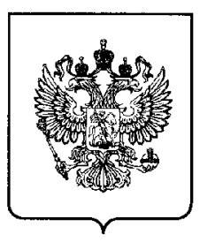
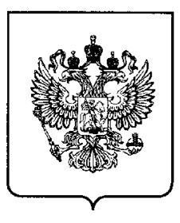

# (19) RU (11) 2 016 861 (13) C1

(51) MIK5 C 03 C 3/112, 4/02

#### РОССИЙСКОЕ АГЕНТСТВО ПО ПАТЕНТАМ И ТОВАРНЫМ ЗНАКАМ

# (12) ОПИСАНИЕ ИЗОБРЕТЕНИЯ К ПАТЕНТУ РОССИЙСКОЙ ФЕДЕРАЦИИ

(21), (22) Заявка: 4948707/33, 23.04.1991
(46) Дата публикации: 30.07.1994
(56) Ссылки: 1. Авторское свидетельство СССР N 1470682, кл. С 03С 3/095, 1989. 2. Авторское свидетельство ЧССР N 206386, кл. С 03С 3/20, 1983.
(71) Заявитель: Лидский завод "Оптик"
(72) Изобретатель: Синевич А.К., Мастицкая Ж.Л., Фиясь А.В.
(73) Патентообладатель: Лидский завод "Оптик"

#### (54) ГЛУШЕНОЕ СТЕКЛО

#### (57) Реферат:

Использование: для облицовочных материалов. Сущность изобретения: глушеное стекло содержит, мас.%: оксид кремния 61,05 - 63,66, БФ SiO 2 ; оксид алюминия 0,86 - 0,92, БФ Al 2O3 ; оксид кальция 9,18 - 9,94, БФ СаО; оксид калия 4,45 - 4,63, БФ К2О ; оксид натрия 14,59 - 15,23, БФ  $Na_2O$ ; оксид мышьяка 0,27 - 0,29, БФ  $As_2O_3$ ; оксид фосфора 2,5 - 5,4, БФ  $P_2O_5$ ; фтор 0,98 - 1, БФ F'; оксид бария 2,18 - 2,28, БФ ВаО; оксид сурьмы 0,27 -0,29, БФ  $Sb_2O_3$ . Температура варки 1370 -1380°С, температура спекания 910 - 920°С. 3 табл.

(19) **RU** (11) **2 016 861** (13) **C1** (51) Int. Cl.5 **C 03 C 3/112, 4/02** 

#### RUSSIAN AGENCY FOR PATENTS AND TRADEMARKS

# (12) ABSTRACT OF INVENTION

| (21), (22) Application: <b>4948707/33, 23.04.1991</b> (46) Date of publication: <b>30.07.1994</b> | (71) Applicant: LIDSKIJ ZAVOD "OPTIK"                        |  |  |
|------------------------------------------------------------------------------------------------------|-----------------------------------------------------------------|--|--|
|                                                                                                      | (72) Inventor: SINEVICH A.K., MASTITSKAJA ZH.L., FIJAS' A.V. |  |  |
|                                                                                                      | (73) Proprietor: LIDSKIJ ZAVOD "OPTIK"                       |  |  |

#### (54) OPAQUE GLASS

(57) Abstract:

FIELD: glass industry. SUBSTANCE: opaque glass has, wt.-%: silicon oxide (SiO2) 61.05-63.66; aluminium oxide (Al2O3) 0.86-0.92; calcium oxide (CaO) 9.18-9.94; potassium oxide (K2O) 4.45-4.63; sodium oxide (Na2O) 14.59-15.23; arsenic oxide (As  $_2O_3$ ) 0.27-0.29; phosphorus pentoxide (P  $_2O_5$ ) 2.5-5.4; fluoride (F') 0.98-1; barium oxide (BaO) 2.18-2.28, and antimony oxide (Sb  $_2O_3$ ) 0.27-0.29. Making temperature is 1370-1380 C, caking point is 910-920 C. Glass is used for making of facing materials. EFFECT: enhanced quality of glass. 3 tbl

2016861 C

刀

C

Изобретение относится к производству глушеного стекла, используемого для изготовления различных облицовочных материалов, частности в декоративно-облицовочной плитки. стекломрамора, стеклокремнезита.

Известно глушеное стекло [1] состава, мас.%: SiO2 57,8-62,3; Al2O3 18,0-18,7; Na2O 9,0-11,1; K2O 5,3-5,8; Fe2O3 1,0-1,1; MgO 0,2-0,3; CaO 1,2-1,3; F' 1,5-5,4.

Недостатком этого стекла является то, что в процессе получения облицовочной плитки путем спекания стеклогранулята этого стекла происходит грубая поверхностная кристаллизация фтористых соединений. В результате образуется пятнистая поверхность плитки с чередованием матовых пятен и **участков** с огненно полированной поверхностью. Это явление происходит по той причине, что нижний предел кристаллизации указанных фтористых стекол лежит в температурном интервале между температурой спекания стеклогранулята и верхней температурой отжига плитки. Длительная выдержка изделия (плитки) в этом интервале приводит к чрезмерному что pocty кристаллов фторидов, проявляется матовостью поверхности.

Наиболее близким к предложенному стеклу по химическому составу и свойствам является глушеное стекло следующего состава, мас.%: SiO2 60-70; Na2O и/или К2O 15-22; СаО 7-12; Р2О5 2,5-5; фториды 1-5; Al 2O3 до 2,5; As2O3 до 1 [2]. Недостатком этого стекла является довольно высокая температура варки и спекания 1400 °С и 940 °С соответственно.

Цель изобретения снижение температуры варки и спекания стекла.

Поставленная цель достигается тем, что глушеное стекло содержит следующие оксиды, мас.%: 61,05-63,66;  $SiO_2$ Al 2O3 0,86-0,92; BaO 2,18-2,28; CaO 9,18-9,94; K2O 4,45-4,63; Na2O 14,59-15,23; As 2O3 0.27-0.29; 0.27-0.29; Sb2O3 P 2O5 2,5-5,4; F' 0,98-1,0.

Для получения цветных стекол стекло может дополнительно содержать один из перечисленных красителей (в кг) на 100 кг стекла сверх 100% состава: - сиреневый цвет 1,1-2,2 MnO2 - зеленый цвет 0,08-0,12 К 2Cr2O7 - малахитовый цвет 0,06-0,1 К2Cr2O7

1,5-2,2 CuSO4 ·5H2O - розовый цвет 0,1 Se. Основным компонентом смесей для варки

стекла является вторичное сырье - стеклобой - отход стекольного производства. В качестве вспомогательных материалов к стеклобою добавляются аммофос или суперфосфат. криолит - как глушители силикатных стекол, соду - как плавень, способствующий развару смеси и растворению красителей; красители 10 для обеспечения цвета. Составы шихт

5

30

35

45

50

приведены в табл.1, конкретные составы стекол - в табл.2.

Стеклобой перед приготовлением смеси измельчают до размера кусков 3-10 мм, затем смешивают с остальными компонентами 15 шихты.

Варку стекла ведут в 2-литровых тиглях из керамики в лабораторной кваршевой газоплазменной печи. Температура варки 1370-1380°С, длительность 3 ч. Проваренную

стекломассу отливали из тигля в емкость с 20 водой. Образовавшийся стеклогранулят использовали для производства облицовочной плитки (стеклокристаллита) по методу спекания в туннельной печи. Получены цветные плитки с хорошим

25 глушением, огненно полированной поверхностью Свойства стекла И стеклоплитки из него, полученой по методу спекания, приведены в табл.3.

Из табл.3 следует, что температура варки и спекания стекла ниже, чем у известного.

ഗ

ω

ഗ

### Формула изобретения:

ГЛУШЕНОЕ СТЕКЛО, включающее SiO2, Al2O3, CaO, K2O, Na2O, As2O3, P2O5, F1, отличающееся тем, что, с целью снижения температуры варки и спекания, оно дополнительно содержит ВаО и Sb2O3 при соотношении следующем компонентов. мас % SiO2 61,05 - 63,66

Al2O3 0,86 - 0,92 CaO 9.18 - 9.94 40 K2O 4.45 - 4.63 Na2O 14.59 - 15.23 As2O2 0.27 - 0.29 P2O5 2,5 - 5,4

> F1 0,98 - 1,02 BaO 2.18 - 2.28 Sb2O3 0,27 - 0,29

フ

55

60

### Таблица 1

| Состав | Содержание компонентов, мас. % |             |         |      |  |
|--------|--------------------------------|-------------|---------|------|--|
|        | Стеклобой                      | Суперфосфат | Криолит | Сода |  |
| 1      | 91,55                          | 3,99        | 1,84    | 2,62 |  |
| 2      | 89,82                          | 5,72        | 1,83    | 2,63 |  |
| 3      | 88,78                          | 6,80        | 1,8     | 2,59 |  |
| 4      | 87,83                          | 7,79        | 1,8     | 2,58 |  |
| 5      | 86,92                          | 8,75        | 1,8     | 2,53 |  |

### Таблица 2

с Т

16861

0 ~'

⊃

2

| Оксиды                         | Состав, мас.% |       |       |       |       |
|--------------------------------|---------------|-------|-------|-------|-------|
|                                | 1             | 2     | 3     | 4     | 5     |
| SIO 2               | 63,66         | 62,78 | 62,13 | 61,61 | 61,05 |
| Al 2 O 3 | 0,92          | 0,90  | 0,89  | 0,86  | 0,87  |
| BaO                            | 2,28          | 2,23  | 2,22  | 2,19  | 2,18  |
| CaO                            | 9,18          | 9,44  | 9,62  | 9,78  | 9,94  |
| K2O                            | 4,63          | 4,57  | 4,53  | 4,49  | 4,45  |
| Na 2 O              | 15,23         | 15,00 | 14,85 | 14,73 | 14,59 |
| As203                          | 0,29          | 0,29  | 0,29  | 0,28  | 0,27  |
| Sb2O3                          | 0,29          | 0,29  | 0,29  | 0,28  | 0,27  |
| P2O5                           | 2,5           | 3,5   | 4,2   | 4,8   | 5,4   |
| F'                             | 1,02          | 1,00  | 0,98  | 0,98  | 0,98  |

Таблица З

| Показатель              | Состав       |              |               |              |                |
|-------------------------|--------------|--------------|---------------|--------------|----------------|
|                         | 1            | 2            | 3             | 4            | 5              |
| Температура             |              |              |               |              |                |
| варки, о С   | 1370±10      | 1375±10      | $1380 \pm 10$ | 1380±10      | 1380           |
| Температура             |              |              |               |              |                |
| спекания, °С            | 910          | 910          | 920           | 920          | 920            |
| Удельная мас-           |              |              |               |              |                |
| са, кг/м 3   | 2,51         | 2,5          | 2,48          | 2,5          | 2,5            |
| Степень глу-            |              |              |               |              |                |
| шения после             |              |              |               |              |                |
| термообра-              | полупрозрач. | хорошее, по- | хорошее, по-  | хорошее, по- | грубая по-     |
| ботки                   | стекло       | верх. бле-   | верх. бле-    | верх. бле-   | верх. кристал. |
|                         |              | стящ.        | стящ.         | стящ.        |                |
| Предел проч-            |              |              |               |              |                |
| ности при               |              |              |               |              |                |
| сжатии, МПа             | 940          | 930          | 945           | 940          | 935            |
| КТЛР×10 -7 , |              |              |               |              |                |
| град. -1     | 105          | 104          | 103           | 103          | 103            |