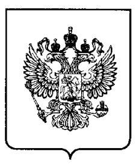

# (19) RU (11) 2 069 198 (13) C1

(51) MΠK6 C 03 C 3/064, 8/24

#### РОССИЙСКОЕ АГЕНТСТВО ПО ПАТЕНТАМ И ТОВАРНЫМ ЗНАКАМ

# (12) ОПИСАНИЕ ИЗОБРЕТЕНИЯ К ПАТЕНТУ РОССИЙСКОЙ ФЕДЕРАЦИИ

- (21), (22) Заявка: 94036217/33, 29.09.1994
- (46) Дата публикации: 20.11.1996
- (56) Ссылки: 1. Патент США N 4949065, кл. Н 01 С 1/012, 1990. 2. Авторское свидетельство СССР N 1247360, кл. С 03 С 3/072, 1990. 3. Саруханишвили А.В. Многомарганцевые боратные и силикатные стекла. - М.: Мир, 1989. 4. Авторское свидетельство СССР N 1608142, кл. С 03 С 3/072, 1990.

## (54) СТЕКЛО

(57) Pechepar:

Использование: для стеклосвязующих толстопленочных резистивных элементов и может быть использовано в электро-, радиотехнической, электронной и других смежных отраслях промышленности.

Сущность изобретения: стекло содержит в

(71) Заявитель: Московский государственный институт

- электронной техники
- (72) Изобретатель: Петрова В.З., Шутова Р.Ф., Осипенкова Н.Г., Костенич Л.А.
- (73) Патентообладатель: Московский государственный институт электронной техники
- мас.%: оксид кремния 8...48 БФ SiO2, оксид марганца 32...61 БФ MnO, оксид бора 4...47 БФ  $B_2O_3$ , оксид меди 1...8 БФ CuO, оксид алюминия 7...21 Al2O3, оксид ванадия 1...8 БФ V2O5. Гидролитический класс стекла I-II, температура начала деформации стекла 520 620°C. 2 табл.

0

# (19) RU (11) 2 069 198 (13) C1 (51) Int. Cl.6 C 03 C 3/064, 8/24

### RUSSIAN AGENCY FOR PATENTS AND TRADEMARKS

# (12) ABSTRACT OF INVENTION

| (21), (22) Application: 94036217/33, 29.09.1994 (46) Date of publication: 20.11.1996 | (71) Applicant: Moskovskij gosudarstvennyj institut ehlektronnoj tekhniki                                                                                                                |
|-----------------------------------------------------------------------------------------|------------------------------------------------------------------------------------------------------------------------------------------------------------------------------------------------|
|                                                                                         | <ul> <li>(72) Inventor: Petrova V.Z., Shutova R.F., Osipenkova N.G., Kostenich L.A.</li> <li>(73) Proprietor: Moskovskij gosudarstvennyj institut ehlektronnoj tekhniki</li> </ul> |

# (54) GLASS

(57) Abstract:

刀

C

2069198

C

FIELD: electrical, radio, electronic and other related industries. SUBSTANCE: glass comprises, wt.-%: 8- 48 silicon oxide; 32-61 manganese oxide; 4-47 boron oxides; 1-8 copper oxide; 7-21 aluminium oxide; 1-8 vanadium oxide. Hydrolytic class of glass I-II, starting glass deformation temperature 520-620 C. EFFECT: improved properties of glass. 2 tbl

Изобретение относится к составам стекол преимущественно для стеклосвязующих толстопленочных резистивных элементов и может быть использовано в электро-, радиотехнической, электронной и других смежных отраслях промышленности.

В последние годы большое внимание уделяется толстопленочным резистивным элементам, проводящая фаза которых представлена соединениями недрагоценных металлов. Применение таких резисторов позволяет снизить затраты при изготовлении схем.

Известны стекла, применяющиеся в качестве стеклосвязующего для резисторов на основе соединений недрагоценных металлов и являющиеся функциональными, то есть обеспечивающими образование проводящей фазы или некоторой ее части в процессе вжигания резистивных слоев. Применение функциональных стекол в качестве стеклосвязующего в резистивных композициях позволяет повысить фаз однородность распределения в элементах, что резистивных улучшает электрофизические свойства получаемых толстопленочных резисторов. Однако ранее разработанные стекла либо не позволяют проводить вжигание резисторов на воздухе [1] либо обладают низкой влагостойкостью [2] что затрудняет и удорожает технологический процесс, а также не позволяет получить резисторы с минимальным дрейфом сопротивления после воздействия влаги.

Указанная проблема может быть решена применения в качестве путем стеклосвязующего в резистивных композициях стекол, содержащих оксиды марганца, поскольку они имеют высокую влагостойкость и обладают поверхностной [3] что электронной проводимостью обуславливает их применение в качестве функциональных связующих для толстопленочных резистивных элементов.

λ

ത

CO

ശ

 $\infty$ 

Наиболее близким к предлагаемому изобретению по составу и технической сущности является стекло [4] содержащее (Mac.): 11.30 SiO2, 3.24 B2O3, 20.67 PbO, 0.8.20 CuO, 0,2.24 MnO. Это стекло используют в качестве стеклосвязующего для получения низкоомных толстопленочных рутениевых резисторов. Однако применение его в качестве стеклосвязующего в резистивных композициях на основе соединений недрагоценных металлов невозможно из-за наличия в составе стекла РbO. Оксид свинца (II) проявляет высокую реакционную способность по отношению к проводящей материалу фазы недрагметальных резисторов, вследствие чего в процессе вжигания в резистивных композициях протекают неконтролируемые химические реакции. Это не позволяет резистивные элементы попучать CO стабильными электрофизическими характеристиками.

Целью изобретения является снижение реакционной способности стекла по отношению к проводящей фазе недрагметальных резисторов.

Указанная цель достигается тем, что стекло, включающее SiO2, MnO, B2O3, CuO дополнительно содержит Al2O3 и V2O5, при следующем соотношении компонентов (мас.): SiO2 8.48 MnO 32.61 B2O3 4.47 CuO 1.8 Al2O3 7.21

5

10

15

20

25

Соотношение основных компонентов стекла (SiO2, MnO, B2O3) выбиралось таким образом, чтобы обеспечивалась максимальная влагостойкость данного материала при относительно низкой температуре размягчения стекла и ТКЛР стекла, близком к ТКЛР керамической

подложки. При содержании SiO2 в стекле менее 8 мас. влагостойкость ухудшается, а в стеклах, содержащих более 48 мас. SiO2 эффект электронной поверхностной проводимости выражен слабо.

Превышение содержания MnO свыше 61 мас. ведет к тому, что стекла плохо провариваются из-за недостаточного содержания стеклообразователей.

При содержании B2O3 более 47 мас. в стеклах наблюдается ликвация, менее 4 мас. стекла теряют способность к пленкообразованию, что ухудшает качество резистивных слоев.

Введение Al2O3 повышает влагостойкость стекла, однако содержание Al2O3 более 21 мас. нежелательно с точки зрения увеличения тугоплавкости системы.

CuO и V2O5 вводили для регулирования 30 сопротивления стекломатериала с целью получения номиналов резисторов в возможно широком диапазоне, а также для достижения оптимальных значений ТКС резисторов. Выбор пределов концентрации CIIO обусловлен тем, что как при более низких, 35 так и при более высоких значениях концентраций не достигается оптимального значения ТКС резисторов. Эффект от введения менее 1 мас. V2O5 незначителен, а при введении его более 8 мас. ТКС резисторов увеличивается. 40

Кроме того, введение в состав стекла дополнительно Al2O3 и V2O5 при указанном выше соотношении остальных компонентов способствует расширению области стеклообразования исследуемой системы,

45 сведений о чем ранее не имелось. Это позволяет получить стеклосвязующее для толстопленочных композиционных резистивных материалов, которое, в отличие от известных, инертно по отношению к

проводящей фазе недрагметальных резистивных композиций, обладает высокой электропроводностью за счет значительного содержания MnO, имеет хорошую влагостойкость, обусловленную большим содержанием оксидов кремния и алюминия, при этом ТКЛР стекла близок к ТКЛР алюмооксидной керамики, а температура размягчения стекломатериала относительно невелика.

Изобретение поясняется конкретными примерами.

60 Стекла получали следующим образом. Порошки исходных химически чистых компонентов шихты высушивали, взвешивали в определенных количествах, соответствующих заданным составам стекол (табл. 1), тщательно перемешивали и сплавляли в корундизовых тиглях емкостью 100 мл в печи с карбидкремниевыми

-3-

RU 2069198 (

нагревателями. Подъем температуры в печи осуществляли со скоростью 5. 10 °С/мин, при достижении температуры 1350.1450 °С расплав выдерживали в течение 30.45 минут. Расплав вырабатывали в виде образцов требуемой конфигурации, а также гранулировали в воду.

Гранулят стекол высушивали при 110.140 °С в течение 4.5 часов в сушильном шкафу и измельчали до удельной поверхности 600.1000 м2/кг на планетарной мельнице в халцедоновом барабане.

Изготавливали резистивные композиции, содержащие в заданных соотношениях стеклопорошки и порошки попученные соединений недрагоценных металлов в Затем качестве приводящей фазы. приготовляли пасты для толстопленочных резисторов путем смешивания резистивных композиций с раствором этилцеллюлозы в терпинеоле на пастотерке. Соотношение порошка резистивной композиции и раствора этилцеллюлозы выбиралось таким образом, чтобы обеспечивалось высокое качество трафаретной печати.

Плотность стекол измеряли методом гидростатического взвешивания.

Температуру размягчения и ТКЛР стекол определяли методом дилатометрии по стандартной методике на дилатометре ДКВ-5А.

Гидролитический класс стекол определяли порошковым методом.

Тестовые образцы резисторов для измерения электрофизических параметров изготавливали на подложках из высокоглиноземистой керамики ВК-94. Резистивные элементы формировали из приготовленной пасты методом трафаретной печати с последующей сушкой и вжиганием в конвейерной печи в воздушной атмосфере при температуре 720 850°С.

Качество толстых пленок оценивали визуально под микроскопом типа МБС-9.

Сопротивление полученных резисторов измеряли омметром Е6-10.

Температурную зависимость сопротивления резисторов измеряли при помощи хромельалюмелевого

термоэлектрического преобразователя, потенциометра КСП-4 и омметра Е6-10.

Результаты испытаний показывают (табл. 2), что на основе стекла заявляемого состава, в отличие от стекла [4] можно получать резистивные пасты, не содержащие 15 драгоценных металлов и обеспечивающие получение резистивных элементов со стабильными электрофизическими параметрами.

В результате улучшения характеристик толстопленочных резистивных элементов, не содержащих драгоценных металлов, обеспечивается повышение качества гибридных интегральных схем, и это дает основание ожидать существенный экономический эффект от их внедрения.

### Формула изобретения:

Стекло, включающее SiO2, MnO, B2O3, CuO, отличающееся тем, что дополнительно содержит Al2O3 и V2O5 при следующем соотношении компонентов, мас.

SiO2 8 48 MnO 32 61 B2O3 4 47 CuO 1 8 Al2O3 7 21 V2O5 1 8

0 0 0

ဖ က 5

10

25

30

35

40

50

55

60

-4-

| Наименование оксида         | Содержание оксида (мас. %) в стекле N |      |      |      |      |      |      |  |
|--------------------------------|---------------------------------------|------|------|------|------|------|------|--|
| 0.00.00                        | 1                                     | 2    | 3    | 4    | 5    | 6    | 7    |  |
| SIO 2               | 48,0                                  | 9,1  | 24,6 | 17,3 | 12,9 | 4,2  | 7,1  |  |
| MnO                            | 37,1                                  | 32,1 | 38,7 | 41,7 | 55,0 | 32,8 | 62,0 |  |
| B 2 O 3  | 4,0                                   | 35,3 | 12,3 | 11,8 | 6,1  | 48,0 | 13,7 |  |
| CuO                            | 1,2                                   | 7.5  | 1,1  | 2,1  | 5,3  | 1,1  | 1,0  |  |
| Al 2 O 3 | 7,0                                   | 8,7  | 20,8 | 19,9 | 13,5 | 8,2  | 13,2 |  |
| V2O5                           | 2,7                                   | 7,3  | 2,5  | 7,2  | 7,2  | 5,7  | 3,0  |  |

Составы стекол

Примечание: стекло 6 — ликвация; стекло 7 — не проварилось.

Таблица 2

C

 $\infty$ 

ດ ~

ດ

ဖ 0 **ה** 

R

Свойства стекол и резисторов на их основе

| Наименование свойства                                             | Значение свойств стекол и резисторов |       |      |      |      |        |  |  |
|-------------------------------------------------------------------|--------------------------------------|-------|------|------|------|--------|--|--|
|                                                                   | 1                                    | 2     | 3    | 4    | 5    | [4]    |  |  |
| Плотность стекла, г/см 3                               | 3,0                                  | 2,9   | 2,9  | 3,3  | 3,9  | 4,6    |  |  |
| Гидролитический класс стекла                                      | !!                                   | н     | I    | I    | I    | I      |  |  |
| Т нд стекла,°С                                                    | 620                                  | 520   | 565  | 560  | 540  | 470    |  |  |
| ТКЛР · 10 7 в интервале 20 – 600°С, К -1 | 52                                   | 87    | 71   | 76   | 80   | 69     |  |  |
| Качество резистивных пленок                                       | удов.                                | удов. | хор. | хор. | хор. | пузыря |  |  |
| Разброс номиналов сопротивле- ний резисторов, %                | 20                                   | 20    | 18   | 16   | 15   | 300    |  |  |

Примечание: стекло 6 — ликвация;

стекло 7 — не проварилось.