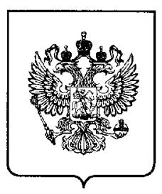
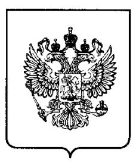

RU(11) 2 044 710(13) C1 (19)

(51) MПК6 C 03 C 8/24

#### РОССИЙСКОЕ АГЕНТСТВО ПО ПАТЕНТАМ И ТОВАРНЫМ ЗНАКАМ

## (12) ОПИСАНИЕ ИЗОБРЕТЕНИЯ К ПАТЕНТУ РОССИЙСКОЙ ФЕДЕРАЦИИ

- (21), (22) Заявка: 5058197/33, 28.09.1992
- (46) Дата публикации: 27.09.1995
- (56) Ссылки: 1. Авторское свидетельство СССР N 1279975, кл. С 03С 8/04, 1986.2. Авторское свидетельство СССР N 1544735, кл. С 03С 8/06, 1990.
- (71) Заявитель:
- Научно-исследовательский институт "Домен"
- (72) Изобретатель: Максимов Н.Н.
- (73) Патентообладатель: Научно-исследовательский институт "Домен"

0

0

4

<u>~ I</u>

# (54) ЛЕГКОПЛАВКОЕ СТЕКЛО ПРЕИМУЩЕСТВЕННО ДЛЯ СПАИВАНИЯ ЭЛЕМЕНТОВ МАГНИТНЫХ ГОЛОВОК

(57) Реферат:

Использование: для изготовления магнитных головок для записывающих устройств и вычислительной техники. Сущность изобретения: легкоплавкое стекло преимущественно для спаивания элементов магнитных головок содержит, мас. оксид бора 38,6-48,9 БФ В2О3 оксид цинка 9,3-14,7 БФ ZnO; оксид лития 0,1-2,6 БФ Li 2O оксид натрия 7,8-16,3 БФ Na  $_2$ O оксид ванадия 27,4-39,6 БФ V $_2O_5$  оксид алюминия 0,1-3,0 БФ Al $_2O_3$  оксид бария 0,5-4,0 БФ ВаО. Свойства стекла: КТР (93-135).10-71/°С температура растекания 520-560°С, микротвердость 440-470 кгс/мм2 количество пузырьков в объеме 1,0 мм3 стекла до 1 шт. водостойкость 6,3-27,5% 2 табл.

(19) RU (11) 2 044 710 (13) C1

(51) Int. Cl.6 C 03 C 8/24

#### RUSSIAN AGENCY FOR PATENTS AND TRADEMARKS

## (12) ABSTRACT OF INVENTION

(21), (22) Application: 5058197/33, 28.09.1992

(46) Date of publication: 27.09.1995

- (71) Applicant:
- Nauchno-issledovatel'skij institut "Domen"
- (72) Inventor: Maksimov N.N.
- (73) Proprietor: Nauchno-issledovatel'skij institut "Domen"

#### (54) LOW-MELTING GLASS MAINLY FOR SOLDERING MAGNETIC HEAD MEMBERS

(57) Abstract:

π

204

0

റ

FIELD: glass industry. SUBSTANCE: low-melting glass has, wt.-% boron oxide (B2O3) 38.6-48.9; zinc oxide (ZnO) 9.3-14.7; lithium oxide (Li2O) 0.1-2.7; sodium oxide (Na2O) 7.8-16.3; vanadium oxide (V2O5) 27.4-39.6; aluminium oxide (Al2O3) 0.1-3.0; barium oxide (BaO) 0.5-4.0. Glass

properties: coefficient of temperature stretching is  $(93-135)\cdot10^{-7}1/^{\circ}C$ , spreading temperature is 520-560 C, microhardness is 440-470 kgs/mm2, bubble quantities in the volume 1,0 mm3 of glass is up to 1, water resistance is 6.3-27.5% Glass is used for making magnetic heads, recording devices and computers. EFFECT: enhanced quality of glass. 2 tbl

Изобретение относится к составам стекол, используемых при изготовлении магнитных головок для записывающих устройств и вычислительной техники.

Известно легкоплавкое стекло для спаивания [1] включающее, мас. В  $_2\mathrm{O}_3$  49-54 Na\_2O 5,5-12 K\_2O 3-9 Li\_2O 2-9 CuO 2-4 ZnO 20-30

Недостатком данного стекла является невысокая адгезия к сендасту вследствие отсутствия в его составе катионов, способствующих резкому улучшению смачивания этого материала, и сравнительно высокая температура растекания более 600 °С из-за большого содержания оксида цинка.

Наиболее близким к изобретению является стекло для спаивания алюминиевых сплавов, включающее, мас. В $_2O_3$  24,0-40,5 ZnO 5-16 Li $_2O$  1-2,7 Na $_2O$  3,5-6 K $_2O$  14-25 V  $_2O5$  20,5-33,0 NaBF4 или KBF4 2,0-6,5

Стекло характеризуется значительно большей адгезией к сендасту, чем стекло [1] так как содержит оксид ванадия, способствующий улучшению смачивания, и растекается при температуре ниже 580 °С. Благодаря значительному содержанию оксида ванадия стекло обладает повышенной эластичностью, а следовательно, большей способностью по сравнению с другими известными стеклами согласовываться при спаивании с материалами, сильно отличающимися по ТКЛР.

Однако это стекло имеет существенные недостатки: неудовлетворительная кристаллизационная устойчивость при спаивании элементов указанных магнитных головок в атмосфере инертного газа и большое количество пузырьков в спаях вследствие недостаточного количества оксида натрия и наличия в составе стекла значительного количества ионов фтора, что исключает возможность использования стекла для изготовления магнитных головок рассматриваемого типа.

Техническим результатом изобретения является повышение кристаллизационной устойчивости, снижение интенсивности образования пузырьков в стекле при спаивании магнитопроводов в атмосфере инертного газа, обеспечение адгезии стекла к сендасту и химической устойчивости по отношению к воде. Технический результат достигается тем, что легкоплавкое стекло, преимущественно для спаивания элементов магнитных головок содержит указанные компоненты, мас. В 2O3 38,6-48,9 ZnO 9,3-14,7 Li2O 0,1-2,6 Na2O 7,8-16,3 V2O5 27,4-39,6 Al2O3 0,1-3,0 BaO 0,5-4,0.

Стекло растекается при температурах ниже 580°С и не растравливает поверхность феррита и сендаста.

- 10 Спаи описываемого стекла с композитными магнитопроводами из марганец-цинкового феррита и напыленного на них сендаста не содержат трещин.
- В табл. 1 приведены конкретные примеры составов предлагаемого стекла, в табл. 2 15 следующие его свойства: ТКЛР интервала 20-300°С, определенный с помощью дилатометра ДКВ-5А; температура растекания Траст, при которой краевой угол смачивания подложки из сендаста становится
- 20 менее 15°; микротвердость по Виккерсу HV, измеренная с помощью микротвердомера ПМТ-3 при нагрузке на индентор, равной 100 г; период времени до появления первых признаков кристаллизации на поверхности капли стекла, растекающейся на подложке из 25 сендаста при температуре растекания в атмосфере инертного газа;

количество пузырьков в объеме 1,0 мм 3 стеклянной части полученных в атмосфере инертного газа спаев указанных зо композитных магнитных головок; потери массы РВ образцов диаметром 20 мм, высотой 8 мм при кипячении в дистиллированной воде в течение 1 ч.

### Формула изобретения:

- ЛЕГКОПЛАВКОЕ СТЕКЛО 35 ПРЕИМУЩЕСТВЕННО ДЛЯ СПАИВАНИЯ ЭЛЕМЕНТОВ МАГНИТНЫХ ГОЛОВОК, включающее B2O3, ZnO, Li2O, Na2O, V2O5, отличающееся тем, что оно дополнительно содержит Al2O3 и BaO при следующем 40 соотношении компонентов, мас.
  - $\begin{array}{c} B_2O_3 & 38,6 & 48,9 \\ ZnO & 9,3 & 14,7 \\ Li_2O & 0,1 & 2,6 \\ Na_2O & 7,8 & 16,3 \\ V_2O_5 & 27,4 & 39,6 \\ Al_2O_3 & 0,1 & 3,0 \\ BaO & 0,5 & 4,0 \end{array}$

50

55

45

5

4710 C4

フ

N

-3-

60

### Таблица 1

| Состав | Содержание компонентов, мас. % |      |                   |                   |      |                                |     |  |  |
|--------|--------------------------------|------|-------------------|-------------------|------|--------------------------------|-----|--|--|
|        | B 2 O 3  | ZnO  | Li 2 O | Na 2 O | V2O5 | Al 2 O 3 | BaO |  |  |
| 1      | 39,7                           | 10,0 | 2,0               | 16,3              | 27,9 | 0,1                            | 4,0 |  |  |
| 2      | 38,6                           | 11,9 | 0,1               | 12,1              | 33,5 | 1,5                            | 2,3 |  |  |
| 3      | 48,9                           | 9,9  | 1,4               | 8,3               | 28,6 | 2,4                            | 0,5 |  |  |
| 4      | 40,0                           | 9,3  | 1,1               | 7,8               | 39,6 | 1,2                            | 1,0 |  |  |
| 5      | 43.8                           | 14,7 | 2,6               | 7,9               | 27,4 | 3,0                            | 0,6 |  |  |

Таблица 2

| Состав | $\alpha \cdot 10^7  {}^{\mathrm{o}}\mathrm{C}^{-1}$ | Т раст , о С | H V , кгс/мм 2 | τ, мин | N,шт | Рв,% |
|--------|-----------------------------------------------------|------------------------------------|--------------------------------------|--------|------|------|
| 1      | 135                                                 | 520                                | 470                                  | 60     | 1    | 20,9 |
| 2      | 105                                                 | 560                                | 440                                  | 55     | 0    | 6,3  |
| 3      | 94                                                  | 550                                | 470                                  | 30     | 1    | 8,2  |
| 4      | 93                                                  | 550                                | 450                                  | 30     | 1    | 27,5 |
| 5      | 95                                                  | 550                                | 470                                  | 50     | 1    | 9,6  |
| Прото- |                                                     |                                    |                                      |        |      |      |
| тип    |                                                     | 560                                |                                      | 3      | 10   | 27   |

RU 2044710 C1